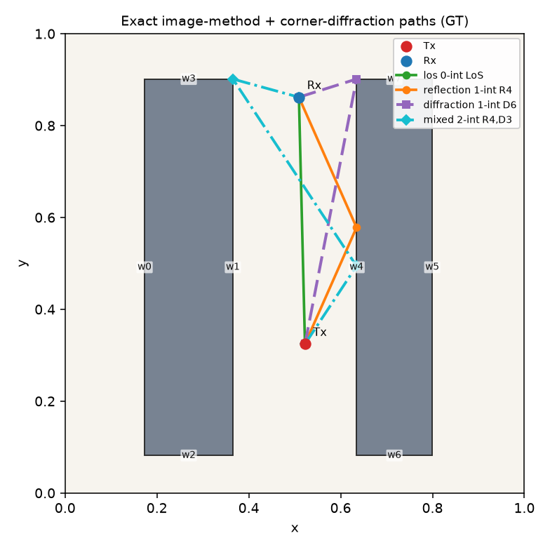
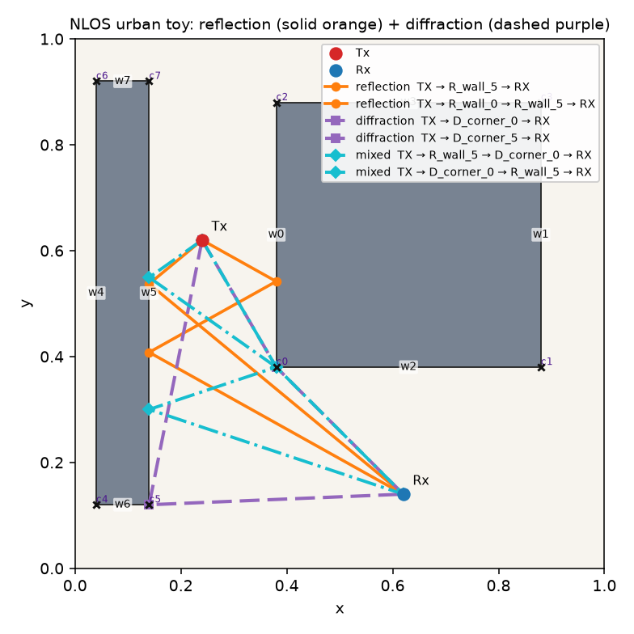
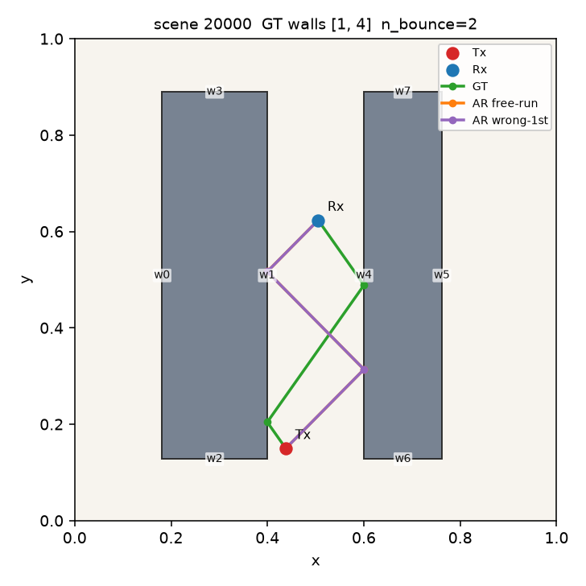
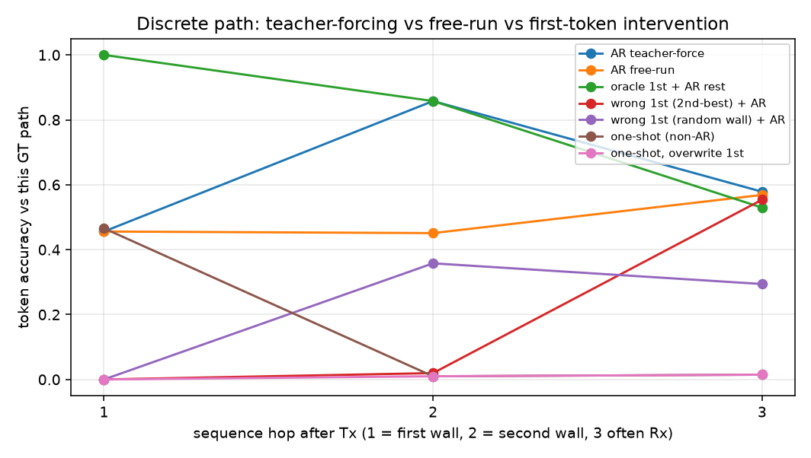
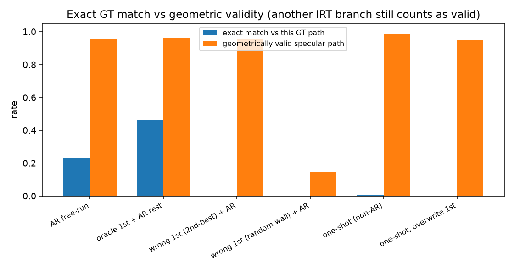
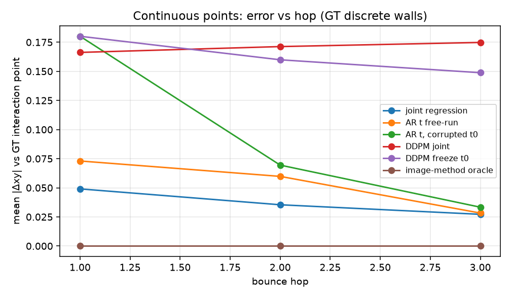

# 传播路径是否适合当作普通 Autoregressive Sequence？

2D 无线电传播路径玩具实验。核心问题不是再做一个工业级射线追踪器，而是：**把 IRT 风格的传播路径直接当成普通自回归序列来生成，是否合适？**

最低要求：用实验证据回答该问题。模型不必优于所有 baseline。

**本次 seed=0 玩具 run 的回答：不适合。**  
论文上，WinProp IRT 把寻径写成 **可见性树搜索**（交互点钉在 tile/墙上，深度只有少数几跳），不是唯一 next-token 句子；RadioDiff 则说明连续无线电几何应对齐 **条件生成** 而不是纯判别——但那是场图，我们只把该课用在固定离散路径上的连续点。  
实验上，第一交互是树上的分支选择；改错第一跳后，相对原 GT 的后续墙会垮掉。若错误第一跳仍落在树上，模型会走出**另一条**合法路径（换枝，不是 AR 纠错）；若第一跳是随机墙（离开树），几何合法率从 0.96 掉到 0.15。连续点在离散墙序列给定后由镜像法闭合（oracle 误差 0）。

对照表见 [`docs/paper_notes.md`](docs/paper_notes.md)；测量见 [`results/findings.md`](results/findings.md)。

---

## 1. 问题

Altair WinProp **Intelligent Ray Tracing (IRT)** 把路径看成：

1. 在离散墙面/tile 上的 **可见性树搜索**（预处理可见性，预测时沿树展开，交互次数通常很少，文档建议最多约 3 次）；
2. 每个离散元件上的 **连续交互点**。

见 [WinProp IRT 用户指南](https://2021.help.altair.com/2021/winprop/topics/winprop/user_guide/propagation_methods/propgation_models_urban_ray_models_irt.htm)。

普通 AR next-token（Transformer/LSTM）假设：下一步主要由局部前缀决定。镜面路径的第一跳其实被 **整条墙序列的镜像几何** 约束；后续跳也不是「再猜一个相邻 token」，而是树上下一条可见边。

## 2. 领域启发（有意做小，不复现 SOTA）

可审计的「文献原句/主张 → 代码对象」对照见 [`docs/paper_notes.md`](docs/paper_notes.md)。

### 2.1 WinProp IRT：路径是树，不是句子

Altair WinProp **Intelligent Ray Tracing**（[用户指南](https://2021.help.altair.com/2021/winprop/topics/winprop/user_guide/propagation_methods/propgation_models_urban_ray_models_irt.htm)；Hoppe, Wölfle, Landstorfer, EPMCC 1999）写明：

1. 墙面先被切成 **tile**、棱边切成 segment，可见性关系 **预处理** 且与基站位置无关；
2. 预测时把寻径变成 **在树结构里搜索**：「每一枝象征两个元件之间的一条可见性关系」；先确定基站能看见的第一层，再递归检查反射/绕射条件；
3. 交互点被约束在这些离散元件上（预处理甚至用中心点代表元件）；射线在到达接收点或达到最大交互次数时停止；**最多约三次交互** 即可。

**本玩具的一一映射（离散 ↔ 树，连续 ↔ tile 上的点）：**

| IRT | 本玩具 |
| --- | --- |
| tile / 墙元件 | 命名边、稳定 `wall_id` |
| 垂直棱 / 楔（绕射） | 矩形角点、稳定 `corner_id` |
| 树节点 | token：`TX` / `R_wall_k` / `D_corner_c` / `RX` |
| 树边（可见性） | 镜像法反射 或 角点绕射 的合法相邻交互 |
| 一条根到叶的射线 | `TX → R_wall_i / D_corner_j → … → RX` |
| 元件上的交互点 | 反射：\(t\in(0,1)\) 落在该墙上；绕射：角点坐标（t 记 0） |
| 最大交互次数 | 2–3 次（反射+绕射合计） |

**为何普通 next-token AR 与此不匹配：**

- 下一步应是树上的一条可见边，并满足 **整段** 镜面/镜像法闭合，不是 \(p(\text{token}_k\mid\text{prefix})\) 去拟合唯一标注序列。
- 同一 Tx/Rx 有 **多条** 合法枝；单序列 AR 监督把树压成一句话。
- **第一交互 = 树的第一层**（发射端可见元件）。选错等于换根；后续局部续写既不能复活原 GT 枝，也不能凭「像下一词」保证几何合法。
- 连续 \(t\) 由 **整段墙序列一次 unfold** 决定，不是由上一个点局部递推。绕射点没有自由 \(t\)：离散角点 token 已经钉死坐标。

### 2.1b 绕射（绕射 / diffraction）玩具映射

WinProp IRT 在预处理/预测里也会检查 **垂直棱、楔的绕射**。本玩具用矩形角点当作 2D 凸 90° 楔，只做 **路径是否存在**，不做场强：

| WinProp / UTD | 本玩具 |
| --- | --- |
| 垂直楔 / 棱边绕射 | `Corner`（`r0_bl` 等），token `D_corner_c` |
| Keller 锥 / 3D 绕射系数 | **没有**；2D 折线过顶点 |
| 轮廓/阴影边界 | 至少一端恰好看见一条前向面（silhouette） |
| 被占 90° 锥 | 两端都不能落在障碍内部锥 |
| 自由空间传播 | 两段都不穿墙 |
| 完整 UTD、爬行波、斜率绕射 | **不做** |

混合路径（反射+绕射）把绕射顶点当中间端点，中间的反射段仍用镜像法闭合。这是几何玩具，不是 WinProp 的工业绕射。

### 2.2 RadioDiff：连续几何用条件生成（我们只借课，不生成场图）

[RadioDiff](https://github.com/UNIC-Lab/RadioDiff)（Wang, Tao, Cheng 等，IEEE TCCN 2024，[arXiv:2408.08593](https://arxiv.org/abs/2408.08593)）的核心论断：无采样 RM 构建被现有 NN **当成判别问题**（MSE 回归），但路径损耗的数值与位置并不已经出现在输入环境里，必须被 **生成**；连续场也难以靠有限分类超平面得到。因此他们把 RM 建成 **条件生成 / 去噪扩散**。

**映射到本玩具时必须分清对象：**

- RadioDiff 生成的是整张 **pathloss map**。
- 我们 **不重实现** RadioDiff（没有 attention U-Net、自适应 FFT、解耦扩散、动态障碍场）。
- 我们把同一归纳用在 IRT 已经给出的 **离散路径结构** 上：联合预测或小 DDPM 去噪 \(t\in(0,1)^K\)，而不是逐步 AR 猜下一个点。
- seed=0 上小 DDPM **没有** 超过联合回归；保留这一真实结果。

### 2.3 RadioUNet：只当判别式基线的上下文

RadioUNet（Levie 等）是典型的 CNN **判别式** 无线电地图估计。RadioDiff 正是针对这类方法的错位提出生成式。本玩具只用占用栅格 + Tx/Rx 热斑做场景 CNN，**不** 估计 RM、**不** 与 RadioUNet 比 NMSE。

| 来源 | 本玩具里怎么用 |
| --- | --- |
| RadioUNet | 仅场景上下文：占用栅格 + Tx/Rx → 小 CNN |
| RadioDiff | 借「连续几何 = 条件生成」；生成对象换成墙上的 \(t\)，不生成场图 |
| ILO + PGD（可选） | 冻住被污染的 \(t_0\) 再采样（玩具 inpaint） |
| 3DGS（可选类比） | 离散元件 + 连续属性 |
| WinProp IRT | 离散墙序列 + 连续点；镜像法；≤2–3 跳 |

## 3. 方法

```
env/          轴对齐矩形障碍、稳定 wall/corner ID、占用栅格
pathfind/     镜像法镜面反射 + 矩形角点绕射（Keller/UTD 存在性玩具）
data/         JSONL+NPZ（几何、R/D token、连续点、合法性）
models/       小 AR Transformer、认真训练的因果 Transformer 对照、one-shot 序列头、联合回归 / AR-t / 小 DDPM
experiments/  训练 + 强制改第一跳的误差累积实验 + 反射/绕射展示图
```

**离散表示：** `TX → R_wall_3 → D_corner_2 → RX`（墙反射 token 与角点绕射 token 分开；ID 在单个场景内稳定）。

**连续表示：** 反射点在所属墙上的 \(t\in(0,1)\)；绕射点就是该角点（t 存 0）。

**对照：** teacher-forcing vs free-run；强制错误第一交互再 AR；one-shot 整段；oracle 第一 token + AR 其余；连续头的联合回归 / AR-t / 小 DDPM vs 镜像法 oracle。

## 4. 怎么跑

```bash
python3 -m pip install -r requirements.txt
PYTHONPATH=. python3 tests/test_image_method.py
PYTHONPATH=. python3 tests/test_diffraction.py
PYTHONPATH=. python3 tests/test_models_shapes.py
PYTHONPATH=. python3 -m experiments.demo_reflect_diffract --out results/figures
PYTHONPATH=. python3 -m experiments.run_all --seed 0 --out results
```

只看反射+绕射几何（不训练）：`python3 -m experiments.demo_reflect_diffract --out results/figures`。

默认 CPU：生成小数据集（约 240/50/70 个场景）→ 训练很小的模型 → 写出 `results/metrics.json`、`results/findings.md` 和 `results/figures/`。整段 demo 大约一分钟量级。它**不**训练下面的 Transformer 对照。

### Transformer 序列基线（更强的 AR 对照，不是新的 GT）

研究问题仍然是：传播路径适不适合当作普通自回归序列。仓库里原来的 `ARPathTransformer`（d=64、2 层、16 epoch、恒定学习率、无位置编码）保持不动，当作普通 AR。`SeriousPathTransformer` 是同一条件上的因果 decoder：同样的场景特征、`R_wall_k` / `D_corner_c` token、seed=0 的 240/50/70 划分，以及同一套第一跳干预（teacher-forcing、free-run、oracle 第一跳、模型第二候选、随机已有墙/角点）。差别是容量（d=128、4 层 pre-norm、学习位置编码、4×FFN）和训练（warmup + cosine、weight decay、dropout、按验证集 teacher-forced next-token accuracy 选 checkpoint，直到验证指标和训练 loss 平台或达到上限）。镜像法路径仍是 ground truth；Transformer 不生成 GT。

```bash
PYTHONPATH=. python3 -m experiments.run_transformer_baseline --seed 0
```

只从 checkpoint 重算对比、不重新训练：

```bash
PYTHONPATH=. python3 -m experiments.eval_transformer \
  --ar-ckpt results/ckpts/ar_transformer.pt \
  --ckpt artifacts/transformer_seq/best.pt \
  --out results
```

测量写在 `results/transformer_comparison.json`、`results/findings.md` 的 Transformer 一节，以及 `results/figures/transformer_vs_ar_hop_accuracy.png`。训练曲线在 `results/figures/transformer_train_curves.png`。超参以 checkpoint 里的 `config` / `train_defaults` 为准。

English: the scientific question is still whether ordinary autoregressive free-run is a fit for multipath interaction sequences. The Transformer is a stronger sequence-model foil under the same data and the same first-hop corruption protocol, not a replacement for the image method.

样本 schema 见生成后的 `data/generated/schema_example.json`。

## 5. 关键发现（seed=0，n=204 条 n_bounces≥2 的测试路径）

完整文字结论见 [`results/findings.md`](results/findings.md)，原始数字见 [`results/metrics.json`](results/metrics.json)。

镜像法 GT（同一峡谷场景里 LoS、两侧 1-bounce、2-bounce ping-pong 同时存在——这就是 IRT 树，不是单一序列）：



同一 NLOS 街区玩具里，**镜面反射与角点绕射画在一张图上**（实线橙 = 反射，虚线紫 = 绕射；图例含 token 序列）：



强制改第一跳之后，模型走出**另一条**合法路径（换枝），而不是沿着原 GT 续写：



| 设定 | 第二墙 vs 这条 GT | 整段 exact | 几何合法 | 落在该场景某条已枚举 GT 分支 |
| --- | ---: | ---: | ---: | ---: |
| AR free-run | 0.451 | 0.230 | 0.956 | （free-run 常是某条合法枝） |
| Oracle 第一墙 + AR 其余 | 0.858 | 0.461 | 0.961 | — |
| 第一跳 = 模型第二候选，再 AR | **0.020** | **0.000** | 0.956 | **0.941** |
| 第一跳 = 随机墙，再 AR | 0.358 | 0.000 | **0.147** | 0.147 |
| One-shot（非 AR） | 0.010 | 0.005 | 0.985 | 短合法枝，对不上这条多跳 GT |





连续点（**离散墙序列给定**）：镜像法 oracle 误差为 0。联合回归 hop1 \(\|\Delta xy\|\approx 0.049\)，后续 0.035；把 \(t_0\) 污染后再做 AR-t，后续 0.053。小 DDPM 后续 0.174，**没有**超过联合回归——这是 CPU 小组件的真实结果，不编造 SOTA。



### 研究问题的回答

**不适合把传播路径直接当成普通 autoregressive sequence 来生成。**

**论文理由。** WinProp IRT 把寻径定义成预处理可见性关系上的树搜索：节点是墙/tile，边是可见性，交互点钉在元件上，深度只有少数几跳；第一层（发射端可见元件）是分支选择。镜像/反射条件是 **整段路径** 的全局约束。普通 AR 假设存在一条应对齐的 token 句子、下一步主要由前缀局部决定——与「树 + 全局镜面闭合」不是同一对象。RadioDiff 补充的是连续无线电几何的课：场不该用纯判别逐步回归；本玩具把该课用在 **固定离散结构上的 \(t\)**（联合生成/回归），明确 **不** 生成 RadioDiff 那种 pathloss map。RadioUNet 只提供占用图编码器的上下文。

**玩具证据（seed=0，数字未改）：**

1. 第一交互是树上的分支选择，不是局部 next-token；相对「这一条」GT，改错第一跳后后续墙准确率从 0.86 掉到 0.02。
2. 第二候选往往是另一条合法 IRT 枝（合法率仍 ~0.96，且 94% 能在场景枚举集里对上），这是换枝，不是 AR 把原序列修补回来。
3. 随机墙离开可见性树后，合法率崩溃到 0.15（缺少全局镜像法一致性）。
4. 连续点在离散结构给定后由几何闭合（oracle 误差 0）；应联合生成/回归，而不是逐步 AR。

Teacher-forcing 第一跳只有 0.46，也说明多路径设定下「一条普通 AR 序列」这个监督本身就是错的。详表与引用见 [`docs/paper_notes.md`](docs/paper_notes.md)。

## 6. 许可

MIT。这是研究玩具，不是 WinProp / RadioDiff 的再实现，也不能当现场规划工具用。
